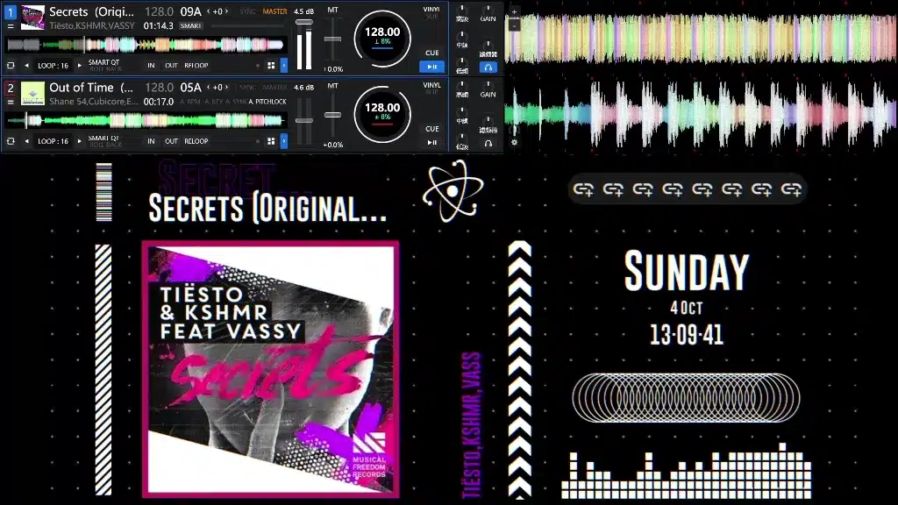
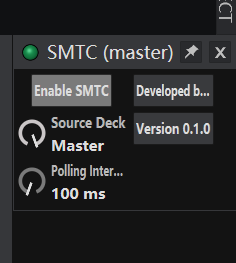

<!-- 模板来源: https://github.com/SmallM1NG/NCM-Auto-Dump-Tool/blob/HEAD/README.md -->

  

<b>SMTC-Plugin-for-VirtualDJ</b>

	
	
	
	
	
	

<b>中文</b> · <a href="README_en.md">English</a>

<a href="#项目介绍">项目介绍</a> · <a href="#功能展示">功能展示</a> · <a href="#如何安装">如何安装</a> · <a href="#如何使用">如何使用</a> · <a href="#其他内容">其他内容</a> · <a href="Docs/md/DEVELOPMENT.md">开发相关</a>

---

## 项目介绍 ℹ️

这是一款可以将你的 VirtualDJ 接入 Windows SMTC (系统媒体传输控制) 的插件.

插件可以向 Windows 共享当前曲目的标题, 艺术家, 专辑, 封面及播放状态, 也支持通过系统媒体按钮控制播放, 暂停, 上一首和下一首. 支持 SMTC 的软件都可以获取信息或调用控制, 例如 Wallpaper Engine.

使用 VirtualDJ 内置设置界面, 支持选择 Deck 1-4, Left, Right 或 Master 作为信息与控制来源.

本地曲目封面从文件标签中读取, 网络曲目封面通过 VirtualDJ 主数据库中的封面链接获取.

> 本项目以 [GPLv3](LICENSE) 开源, 使用, 修改或分发时请遵守该协议.

## 功能展示 ✨

---

## 如何安装 📥

本插件仅支持 **Windows x64** 的 **VirtualDJ 2021 及以上版本**, 需拥有 **VirtualDJ Pro** 许可证才可使用 (这是 VirtualDJ 的硬性要求).

<ol>
<li>

从 [Releases](https://github.com/SmallM1NG/SMTC-Plugin-for-VirtualDJ/releases/latest) 下载最新发行版 **dll** 文件 (当前为 [v0.1.1](https://github.com/SmallM1NG/SMTC-Plugin-for-VirtualDJ/releases/tag/v0.1.1)).

</li>
<li>

将 **SMTC.dll** 放入 VirtualDJ 数据目录的 **Plugins64\AutoStart** 文件夹中.

2023之前的版本, 通常在 `C:\Users\用户名\Documents\VirtualDJ\Plugins64\AutoStart`  
2023之后的版本, 通常在 `C:\Users\用户名\AppData\Local\VirtualDJ\Plugins64\AutoStart`  
如果你更改了数据目录, 请放入你自定义的数据目录内.

</li>
<li>

启动 VirtualDJ, 在 Master 效果列表中看到 **SMTC** 字样, 则为安装成功.

</li>
</ol>

---

## 如何使用 ▶️

### 1. 自动启动

插件默认会随 VirtualDJ 启动而自行开启, 无需手动开启.

### 2. 调整设置

如果你想调整来源等设置, 在 Master 效果列表内找到 **SMTC** 字样, 点击旁边的小齿轮打开内置设置页面.

  

- **Enable SMTC**: 控制插件功能的启用和停用.
- **Source Deck**: 选择 Deck 1-4, Left, Right 或 Master 作为曲目信息和播放控制的来源.
- **Polling Interval**: 设置曲目信息和播放状态的查询间隔, 可选 100-1000 ms, 默认 100 ms. 数值越小, 更新越及时, 查询次数也越多.

设置会在 VirtualDJ 关闭时自动保存.

> 如果想关闭插件功能, 请点击插件设置内的关闭按钮, 不要点击 VirtualDJ 提供的插件关闭功能 (小绿点). 这会导致插件在列表中不可见, 需要重启 VirtualDJ 才能恢复.

---

## 其他内容 📚

<a href="Docs/md/DEVELOPMENT.md">开发相关</a>

### 补充说明 💡

#### 1. 为什么有些歌曲没有封面?

本地曲目只读取文件标签中的内嵌封面. 网络曲目需要 VirtualDJ 主数据库中存在可用的封面链接, 插件会自动下载封面.

如果没有封面, 下载失败或图片超过限制, 插件会保持无封面, 不定时重试. 切走再切回来或重新启用插件时会再次尝试.

#### 2. 修改歌曲标签后为什么没有立即更新?

标题, 艺术家和专辑只在切歌, 切换来源或重新启用插件时读取.

#### 3. 上一首和下一首按哪个列表切歌?

按照 VirtualDJ 浏览器当前歌曲列表切歌. 列表边界和播放中的歌曲能否被替换由 VirtualDJ 决定.

#### 4. 如何查看运行日志?

日志保存在 DLL 同目录的 **SMTC.log** 中.

日志使用英语, 包含 UTC 时间, 条目类型和具体内容. 超过 10 MB 后自动清空并重新写入.

---

### BUG 汇报 😨

请详细描述遇到的问题: 具体行为, 是否可以复现, 并提供 SMTC 插件版本, Windows 版本, 复现步骤, 相关截图以及运行日志文件.

---

### 鸣谢 🙌

为此项目测试的朋友们

---

### LINK 🔗

  <a href="https://space.bilibili.com/475951038">BILIBILI</a>
  ·
  <a href="https://cn.virtualdj.com/wiki/Developers.html">VirtualDJ 开发者文档</a>

---

### 捐赠 🧋

  🥰请我喝奶茶喵 谢谢你喵🥰

  

